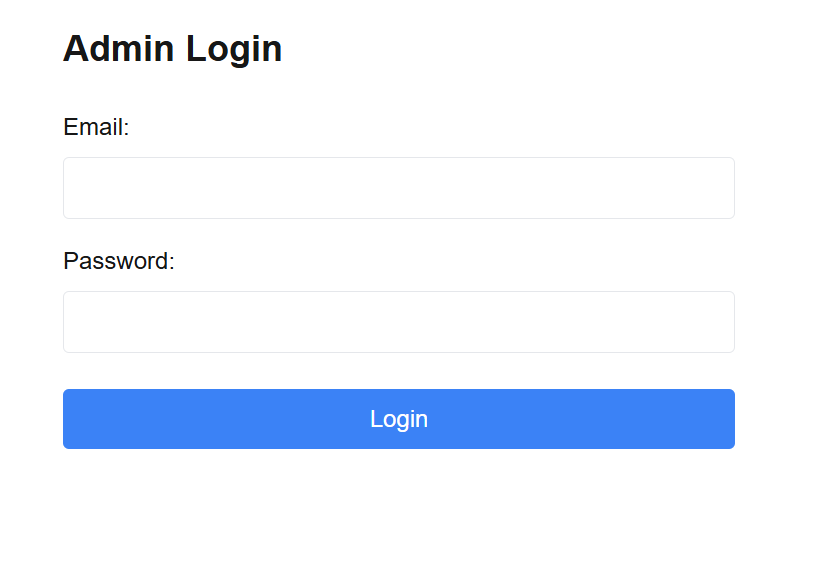

# はじめに

このアプリは、画面上のパイプを適切に回転させて、スタートからゴールまでパイプを繋ぐパズルゲームです。
このゲームはブラウザ上で動作するため、ソフトウェアのインストールが不要で、PCやタブレットなど様々なデバイスからすぐにアクセスできます。
このゲームはnext.jsとデータベースの学習のために作成しました。
直感的に操作できますが、頭を使う必要もあるため、誰でも楽しめるゲームとなっています。
また、管理者向けには専用の管理画面が用意されており、新しいステージの作成や既存ステージの編集が可能です。

[実際のゲームはこちら](https://my-next-fmpwj6mrg-next-blog-apps-projects.vercel.app/)

# 特徴と機能の説明

プレイヤーは画面上に配置された様々な形状のパイプを回転させることができます。パイプには直線、L字型、T字型などの種類があり、これらを適切に組み合わせることでスタートからゴールまでの経路を作り出します。パイプの回転はクリックまたはタップで行うことができ、90度ずつ回転します。また、ゲーム画面では、パイプの接続状態がリアルタイムで表示されます。正しく接続されたパイプは強調されて表示されるので、現在の進捗状況を一目で把握することができます。


## 管理システム

管理者向けの機能として、ステージ管理システムを実装しています。管理者は専用の管理画面から新しいステージを作成することができ、パイプの配置や初期状態の設定、ステージ名の設定など、詳細な編集が可能です。
既存のステージに対しても編集機能を実装しています。パイプの配置を変更したり、ステージ名を変更したりすることが可能で、後からステージの難易度を調整することができます。


## ログイン

管理機能へのアクセスは制限されています。管理者認証にはSupabaseの認証システムを利用しており、認証済みの管理者のみが管理機能にアクセスできます。また、環境変数による設定により、特定のメールアドレスを持つユーザーのみが管理者として認識されます。



# 使用技術 (技術スタック)

## フロントエンド

ゲームのフロントエンドは、TypeScriptをベースに、Next.js 14のApp Routerを採用しています。
UIフレームワークにはTailwindCSSを採用し、レスポンシブでモダンなデザインを実現しています。また、アイコンにはLucide Iconsを使用しています。

## バックエンド

バックエンドの構成には、Prismaを採用しています。
データベースにはPostgreSQLを使用し、Supabaseのホスティングサービスを利用することで、安定したデータベース環境を実現しています。
認証システムにはSupabaseの認証機能を統合し、安全な管理者認証を実装しています。これにより、管理者機能へのアクセスを適切に制御し、不正アクセスを防止しています。データベースの設計では、ステージ情報を効率的に管理できるよう、適切なスキーマ設計を行っています。

## 開発・デプロイ環境

開発環境では、VSCodeをメインのコードエディタとして使用し、ESLintとPrettierを導入することで、コードの品質維持と一貫性の確保を実現しています。
デプロイにはVercelを採用しています。

# 開発期間・体制

- 個人開発
- 開発期間: 2025.1 ~ 2025.2 (約30時間)

# 工夫した点・苦労した点

## データベース設計

データベース設計では、ゲームの要件を満たしながら、将来の拡張性も考慮した構造にしています。
pipesフィールドにはJSONタイプを採用し、複雑なパイプの配置データを柔軟に格納できるようにしています。
以下は4x5のステージデータの例です。typeはパイプの形を表し、directionは方向を表します。isFixedは回転させることができないかを示しています。

```yaml
const exampleStage = {
    name: "Stage 1",
    width: 5,
    height: 4,
    pipes: [
        // 1行目
        [
            { type: "start", direction: 0, isFixed: true }, // スタート地点
            { type: "straight", direction: 90, isFixed: false },
            { type: "corner", direction: 180, isFixed: false },
            { type: "empty", direction: 0, isFixed: false },
            { type: "straight", direction: 90, isFixed: false }
        ],
        // 2行目
        [
            { type: "empty", direction: 0, isFixed: false },
            { type: "corner", direction: 0, isFixed: false },
            { type: "straight", direction: 90, isFixed: false },
            { type: "corner", direction: 270, isFixed: false },
            { type: "empty", direction: 0, isFixed: false }
        ],
        // 3行目
        [
            { type: "corner", direction: 0, isFixed: false },
            { type: "straight", direction: 90, isFixed: false },
            { type: "empty", direction: 0, isFixed: false },
            { type: "straight", direction: 180, isFixed: false },
            { type: "corner", direction: 270, isFixed: false }
        ],
        // 4行目 (最下行)
        [
            { type: "empty", direction: 0, isFixed: false },
            { type: "corner", direction: 90, isFixed: false },
            { type: "straight", direction: 90, isFixed: false },
            { type: "corner", direction: 180, isFixed: false },
            { type: "end", direction: 180, isFixed: true } // ゴール
        ]
    ]
}
```

## ユーザーインターフェースの設計

ユーザーインターフェースの設計では、直感的な操作性を重視しました。パイプの回転操作は単純なクリックで行えるようにして、誰でも迷うことなく操作できるようにしています。
また、パイプの接続状態を明確に表示し、プレイヤーは現在の状況を容易に理解することができるようにしました。画面レイアウトもシンプルに保っています。

## 編集画面

管理者向けの機能は、効率的にステージを管理できるよう設計しています。新規ステージの作成画面では、直感的なインターフェースでパイプの配置や設定が行うことができます。既存のステージの編集も同様に、シンプルな操作で行うことができます。

# 課題と今後の展望

ステージデータのバリデーションが存在しないため、スタートやゴールが存在しないステージが作成可能になっている
パイプの種類を増やしたり、パイプの回転以外のギミックを追加したりすることで、プレイヤーを飽きさせない構成にする
パイプのデザインはSVGのパスで描画しており、少し地味なため、それぞれのパイプのイメージを用意する
