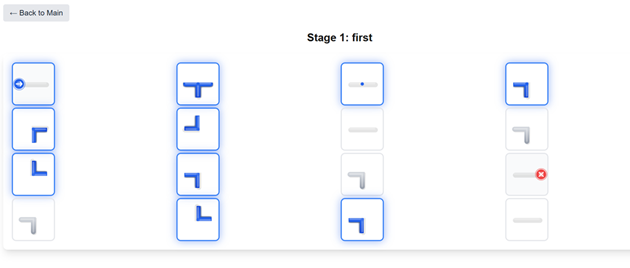
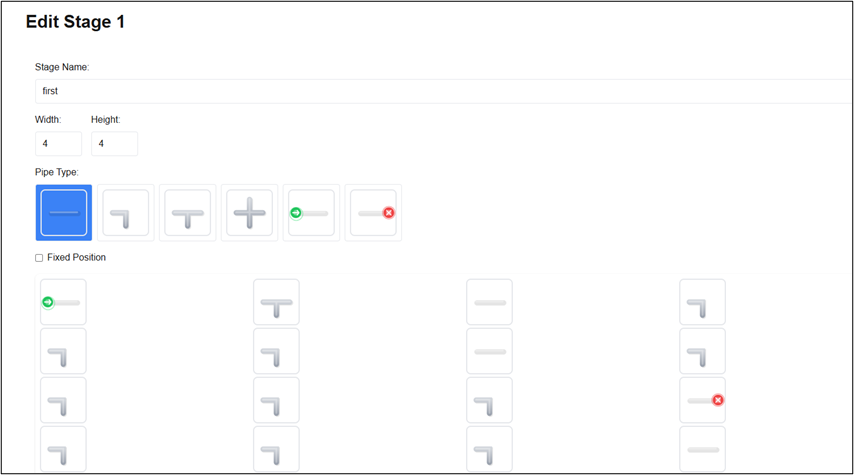
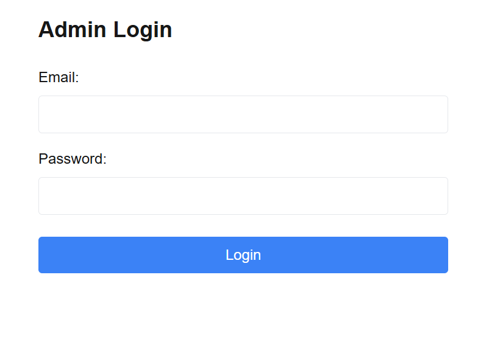

# パイプつなぎゲーム

このアプリは、Youtubeの広告を参考にして作成したパイプパズルゲームです。プレイヤーはグリッド上のパイプを適切に回転させ、スタートからゴールまでパイプを導く必要があります。また、このゲームはブラウザ上で動作するため、ソフトウェアのインストールが不要で、PCやタブレットなど様々なデバイスからすぐにアクセスできます。
パズルの難易度は徐々に上がっていく設計となっており、初心者でも楽しみながらパズルの解き方を学べます。
直感的に操作できますが、頭を使う必要もあるため、子供だけでなく大人も楽しめるゲームとなっています。
また、管理者向けには専用の管理画面が用意されており、新しいステージの作成や既存ステージの編集が可能です。

[実際のゲームはこちら](https://my-next-fmpwj6mrg-next-blog-apps-projects.vercel.app/)

# 特徴と機能の説明

プレイヤーは画面上に配置された様々な形状のパイプを回転させることができます。パイプには直線、L字型、T字型などの種類があり、これらを適切に組み合わせることでスタートからゴールまでの経路を作り出します。パイプの回転はクリックまたはタップで行うことができ、90度ずつ回転します。また、ゲーム画面では、パイプの接続状態がリアルタイムで表示されます。正しく接続されたパイプは強調され、プレイヤーは現在の進捗状況を一目で把握することができます。



## 管理システム

管理者向けの機能として、包括的なステージ管理システムを実装しています。管理者は専用の管理画面から新しいステージを作成することができ、パイプの配置や初期状態の設定、ステージ名の設定など、詳細なカスタマイズが可能です。
既存のステージに対しては、編集機能を実装しています。パイプの配置を変更したり、ステージ名を変更したりすることが可能で、跡からステージの難易度を調整することができます。



## ログイン

セキュリティ面では、管理機能へのアクセスは厳格に制御されています。管理者認証にはSupabaseの認証システムを利用しており、認証済みの管理者のみが管理機能にアクセスできます。また、環境変数による設定により、特定のメールアドレスを持つユーザーのみが管理者として認識されます。



# 使用技術 (技術スタック)

## フロントエンド

アプリケーションのフロントエンドは、最新のWeb技術を駆使して構築されています。TypeScriptをベースに、Next.js 14のApp Routerを採用することで、高いパフォーマンスと開発効率を実現しています。UIフレームワークにはTailwindCSSを採用し、レスポンシブでモダンなデザインを実現しています。また、アイコンにはLucide Iconsを使用し、視覚的な一貫性を保っています。

## バックエンド

バックエンドの構成には、Prismaを採用しています。
データベースにはPostgreSQLを使用し、Supabaseのホスティングサービスを利用することで、安定したデータベース環境を実現しています。
認証システムにはSupabaseの認証機能を統合し、安全な管理者認証を実装しています。これにより、管理者機能へのアクセスを適切に制御し、不正アクセスを防止しています。データベースの設計では、ステージ情報を効率的に管理できるよう、適切なスキーマ設計を行っています。

## 開発・デプロイ環境

開発環境では、VSCodeをメインのコードエディタとして使用し、ESLintとPrettierを導入することで、コードの品質維持と一貫性の確保を実現しています。
デプロイにはVercelを採用しています。Vercelの環境変数管理機能を活用することで、開発環境と本番環境で適切な設定を使い分けることができます。

# 開発期間・体制

- 個人開発
- 開発期間: 2025.1 ~ 2025.2 (約XXX時間)

# 工夫した点・苦労した点

## データベース設計

データベース設計では、ゲームの要件を満たしながら、将来の拡張性も考慮した構造にしています。
pipesフィールドにはJSONタイプを採用し、複雑なパイプの配置データを柔軟に格納できるようにしています。
以下は4x5のステージデータの例です。typeはパイプの形を表し、directionは方向を表します。isFixedは回転させることができないかを示しています。

```yaml
const exampleStage = {
name: "Stage 1",
width: 5,
height: 4,
pipes: [
// 1行目
[
{ type: "start", direction: 0, isFixed: true }, // スタート地点
{ type: "straight", direction: 90, isFixed: false },
{ type: "corner", direction: 180, isFixed: false },
{ type: "empty", direction: 0, isFixed: false },
{ type: "straight", direction: 90, isFixed: false }
],
// 2行目
[
{ type: "empty", direction: 0, isFixed: false },
{ type: "corner", direction: 0, isFixed: false },
{ type: "straight", direction: 90, isFixed: false },
{ type: "corner", direction: 270, isFixed: false },
{ type: "empty", direction: 0, isFixed: false }
],
// 3行目
[
{ type: "corner", direction: 0, isFixed: false },
{ type: "straight", direction: 90, isFixed: false },
{ type: "empty", direction: 0, isFixed: false },
{ type: "straight", direction: 180, isFixed: false },
{ type: "corner", direction: 270, isFixed: false }
],
// 4行目 (最下行)
[
{ type: "empty", direction: 0, isFixed: false },
{ type: "corner", direction: 90, isFixed: false },
{ type: "straight", direction: 90, isFixed: false },
{ type: "corner", direction: 180, isFixed: false },
{ type: "end", direction: 180, isFixed: true } // ゴール
]
]
}
```

## ユーザーインターフェースの設計

ユーザーインターフェースの設計では、直感的な操作性を重視しました。パイプの回転操作は単純なクリックで行えるようにし、誰でも迷うことなく操作できるよう配慮しています。
また、パイプの接続状態を明確に表示し、プレイヤーは現在の状況を容易に理解することができるようにしました。画面レイアウトもシンプルに保ち、不必要な要素を排除しています。

## 編集画面

管理者向けの機能は、効率的なステージ管理を実現できるよう設計しています。新規ステージの作成画面では、直感的なインターフェースでパイプの配置や設定が行うことができます。既存のステージの編集も同様に、シンプルな操作で行うことができます。

# 課題と今後の展望

ステージデータのバリデーションが存在しないため、スタートやゴールが存在しないステージが作成可能になっている。
パイプの種類を増やしたり、パイプの回転以外のギミックを追加したりすることで、プレイヤーを飽きさせない構成にする。
パイプのデザインはSVGのパスで描画しており、非常に地味なものになってしまった。
